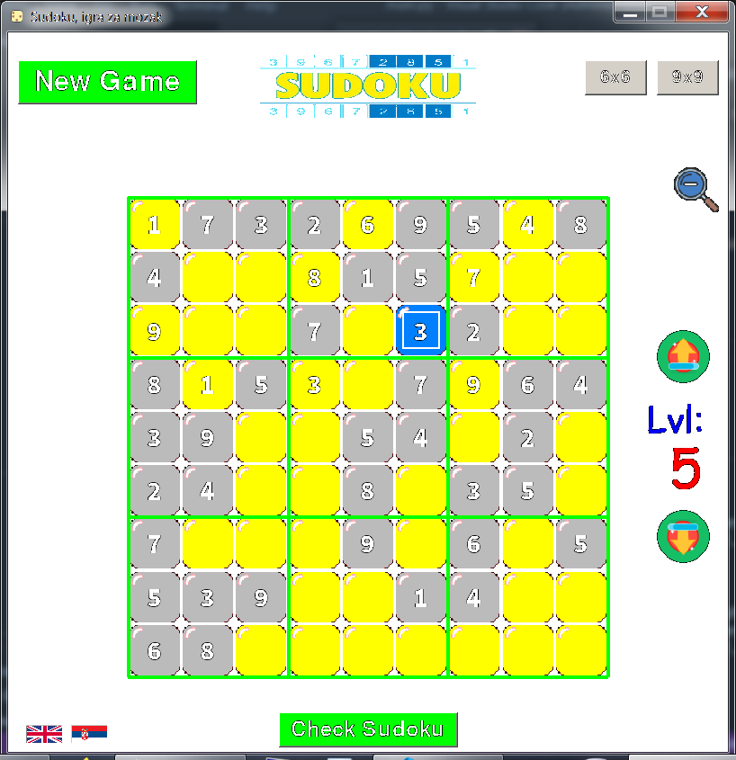

# Sudoku

A well-known puzzle - Sudoku. The game is made in Python using the PyGame library.

## Status

The game is completed. Now in testing mode.

## Getting Started

### Prerequisites 

Before running this application, make sure you have the following installed:
	- Python 3.x
Libraries:
	- pygame

## Usage 

Choose your difficulty level, determine the size of the board and show who is the master of Sudoku.

## Contributing 

If you have any suggestions or find any bugs in the program, please feel free to open an issue or submit a pull request on GitHub.

## License 

This project is licensed under the MIT License.
